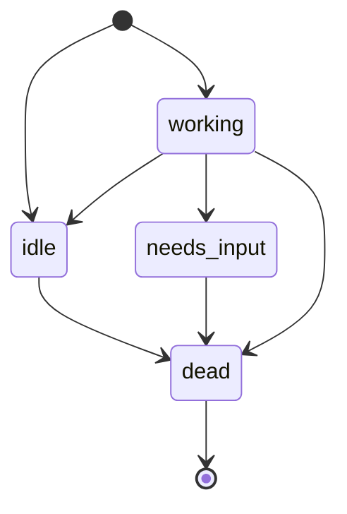

# Minna Session Model v1

## Description

A session is a live, addressable handle to one running agent process, tied to one work
item, that Minna can send more than one message into over time. Separate from the work
item's own `state`/`phase` — a work item can remain `active` across many session turns.

---

## Session

```json
{
  "id": "sess_a91f",
  "work_item_id": "021",
  "project": "celia",
  "actor": "codex",
  "status": "idle",
  "started_at": "2026-07-24T09:00:00Z",
  "last_active_at": "2026-07-24T11:14:00Z"
}
```

| Field | Type |
|---|---|
| `id` | session handle |
| `work_item_id` | which work item this session belongs to |
| `project` | resolves against the project registry (`minna-project-registry.md`) |
| `actor` | `claude` / `codex` / `agy` |
| `status` | `idle` / `working` / `needs_input` / `dead` |
| `started_at` | ISO 8601 timestamp |
| `last_active_at` | ISO 8601 timestamp |

---
---

## Session transitions



| From | To |
|---|---|
| `[*]` | `idle` |
| `[*]` | `working` |
| `working` | `idle` |
| `working` | `needs_input` |
| `working` | `dead` |
| `needs_input` | `dead` |
| `idle` | `dead` |

`dead` is terminal.

`working → needs_input` triggers the session's work item to `active → blocked` (`blocked_reason: clarification-required`).

## Revisions

- **v1** — session shape (incl. `project` field), session-transition diagram + table (`dead` terminal), work-item `blocked` cross-reference.
