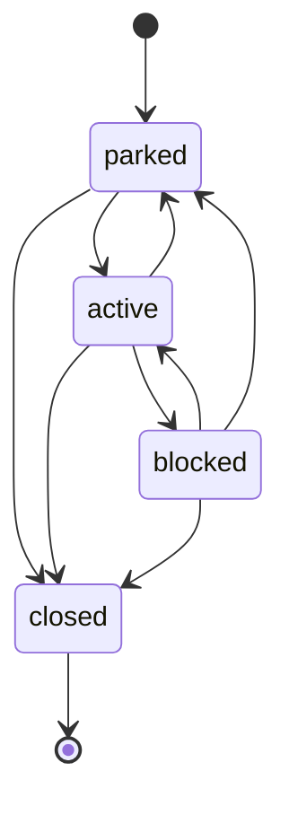
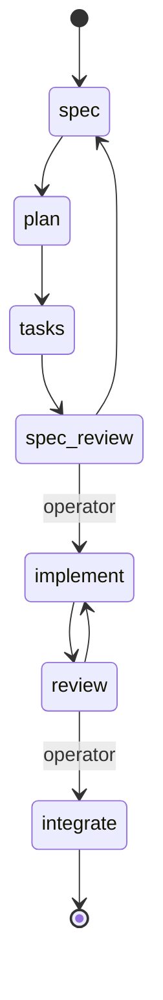

# Minna State Model v1

## Description

The data shape and state machine for Minna work items.

---

## States (4)

| State | Colour (fg on bg) | Who holds the ball | Meaning |
|---|---|---|---|
| `parked` | `#4a544d` on `#dbe0dd` | nobody | Not started — whether deliberately queued or waiting for capacity. |
| `active` | `#101614` on `#00F0FF` | an agent | Something is working on it right now. |
| `blocked` | `#ffffff` on `#7a1f30` | varies — see `blocked_reason` | Progress is stalled. |
| `closed` | `#ffffff` on `#2f9e44` | nobody | Finished. Covers both a successful and a terminal-failed outcome. |

---

## State transitions



| From | To | Trigger |
|---|---|---|
| `parked` | `active` | work started |
| `parked` | `closed` | work dropped |
| `active` | `blocked` | blocked on something |
| `active` | `parked` | work paused |
| `active` | `closed` | work completed |
| `blocked` | `active` | work unblocked |
| `blocked` | `closed` | work abandoned |
| `blocked` | `parked` | work paused |

`closed` is terminal.

A session's `working → needs_input` triggers `active → blocked` (`blocked_reason: clarification-required`) on its work item.

---

## Phases

Apply only when `state = active`.

| Phase | Description |
|---|---|
| `spec` | SpecKit specify |
| `plan` | SpecKit plan |
| `tasks` | SpecKit tasks |
| `spec-review` | 2-lens (architect / engineer) requirement review |
| `implement` | per-phase implementation |
| `review` | per-phase conformance review |
| `integrate` | PR review and manual smoke tests |

---
---

## Phase transitions



| From | To | Trigger |
|---|---|---|
| `spec` | `plan` | Minna |
| `plan` | `tasks` | Minna |
| `tasks` | `spec-review` | Minna |
| `spec-review` | `spec` | Minna |
| `spec-review` | `implement` | Operator |
| `implement` | `review` | Minna |
| `review` | `implement` | Minna |
| `review` | `integrate` | Operator |
| any | any | Operator (max loop reached) |

## Work Item Type

| Type | Description |
|---|---|
| `feature` | Does the full 7-phase SpecKit guided workflow |
| `issue` | Small items that do not warrant a full SpecKit workflow. Starts on implementation. |

---

## Blocked reasons

| `reason` | UI label | Holder |
|---|---|---|
| `clarification-required` | **Needs You** | human |
| `approval-required` | **Needs You** | human |
| `external-dependency` | Blocked (external) | none |
| `ci-pending` | Blocked (CI) | system |
| `failed` | **Needs You** (alarm styling) | human |

---
---

## Work Item (Card)

```json
{
  "id": "021",
  "title": "recurring-transactions",
  "description": "Adds recurring transactions to the budget list.",
  "state": "active",
  "phase": "implement",
  "blocked_reason": null,
  "assignee": "codex",
  "project": "celia",
  "branch": "021-recurring-transactions",
  "pr_url": null,
  "created_at": "2026-07-24T09:00:00Z",
  "updated_at": "2026-07-24T11:14:00Z"
}
```

| Field | Type |
|---|---|
| `id` | 3-digit, project-scoped |
| `title` | slug |
| `description` | single-sentence |
| `state` | see States |
| `phase` | see Phases |
| `blocked_reason` | see Blocked reasons |
| `assignee` | `human` / `minna` / `claude` / `codex` / `agy` / `null` |
| `project` | project id — resolves against the project registry (`minna-project-registry.md`) |
| `branch` | `<id>-<title>` / `null` |
| `pr_url` | URL / `null` |
| `created_at` | ISO 8601 timestamp |
| `updated_at` | ISO 8601 timestamp |

------
## Revisions

- **v1** — states (4, with colours), state-transition diagram + table (incl. `blocked → closed`/`blocked → parked`), session-blocked cross-reference, phases (7), phase-transition diagram + table (Minna/Operator triggers, incl. `spec-review → spec` loop), work item type (2), work item card (all fields typed), blocked-reasons table.
