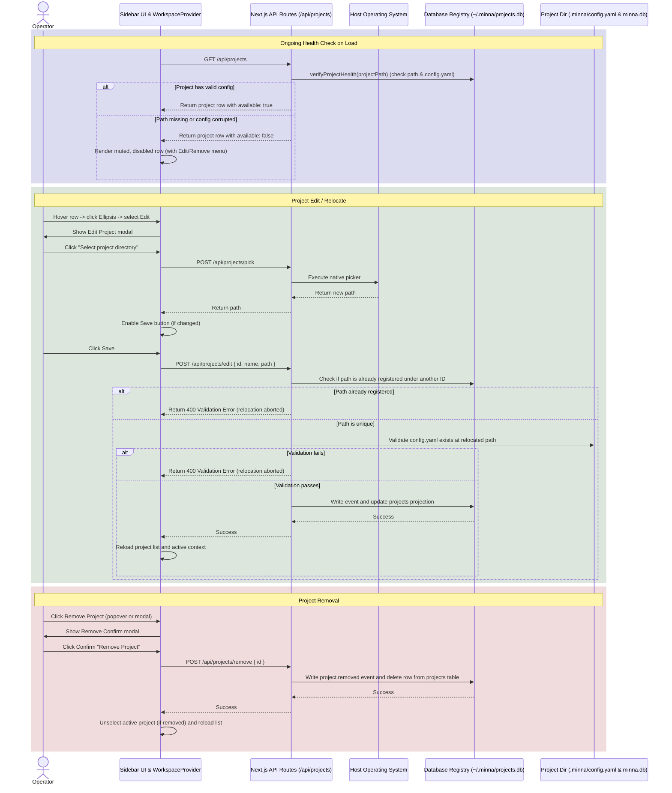

# Implementation Plan: Project Creation & Management

This plan outlines the architecture, data flow, affected components, and validation approach for implementing the Project Creation and management workflow, amended to support Project Update (Rename/Relocate), Project Delete (Remove), and ongoing Project Health Checks.

## Architecture



The system operates across three tiers:
1. **Frontend**: The React client ([Sidebar.tsx](file:///D:/Alvin/_CodeProjects/Project_Minna/src/components/Sidebar.tsx) and [WorkspaceProvider.tsx](file:///D:/Alvin/_CodeProjects/Project_Minna/src/components/WorkspaceProvider.tsx)) which triggers directory picking, invokes the project APIs, handles success/rejection UI states, displays recent projects, and mounts the edit/remove modals.
2. **Next.js Backend Server API**: Node.js endpoints that handle OS folder picker commands, project config read/write operations, validation logic, and registry mutations.
3. **CLI Utilities**: A narrow CLI module that syncs the registry (`~/.minna/projects.db`) whenever a CLI command runs inside a project.

---

## Data Flow & Policies

### 1. Unified Project Health Check helper
To ensure consistent checks across endpoints, a single verification function is exported from `src/core/registry.ts`:
```typescript
export function verifyProjectHealth(projectPath: string): { available: boolean; error?: string };
```
- Checks that the folder exists.
- Checks that `.minna/config.yaml` is present and contains valid schema details.
- Returns `{ available: true }` if both check out, and `{ available: false, error }` if they do not.
- This helper is imported and called by:
  - `GET /api/projects` in [route.ts](file:///D:/Alvin/_CodeProjects/Project_Minna/src/app/api/projects/route.ts)
  - `POST /api/projects/open` in [open/route.ts](file:///D:/Alvin/_CodeProjects/Project_Minna/src/app/api/projects/open/route.ts)
  - CLI project context resolver in [project-context.ts](file:///D:/Alvin/_CodeProjects/Project_Minna/src/core/project-context.ts)
- This avoids split health-checking logic across endpoints.

### 2. Self-Healing database recreation on open
- Reads (`GET /api/projects`) must **never** mutate on-disk state. If only the local SQLite database `.minna/minna.db` is missing (but the folder and `config.yaml` are intact), the project is considered healthy (`available: true`).
- Mutation actions (such as `POST /api/projects/open` or CLI startup execution) trigger the self-healing. When opening the project context, the system runs `prepareProject(projectPath)` which lazily initializes `.minna/minna.db` tables, ensuring the project becomes fully operational.

### 3. Relocate Path Collision Policy
- Relocating a project's path is verified against all registered paths in the database.
- If the new path is already registered under a different project ID, `/api/projects/edit` rejects the request immediately with a `400 Bad Request` validation error, preventing unique key constraint violations in the database.

### 4. Event Types & Registry Log Exports
Registry changes are recorded in `~/.minna/projects.db` using transactions, standardizing on these exact event type names and payloads:
- `project.registered` (payload: `{ id, name, path }`)
- `project.opened` (payload: `{ id, name, path }`)
- `project.renamed` (payload: `{ id, name, path }`)
- `project.relocated` (payload: `{ id, name, path }`)
- `project.removed` (payload: `{ id }`)

On every transaction commit, the registry helper writes:
1. `~/.minna/projects.json` (Calculated current projects list).
2. `~/.minna/registry-events.json` (Full database events table history export for audit trail).

---

## Visual Design Reference & Interactive Prototype

Interactive prototype design specifications for project management are located at:
- **Design Prototype**: [handoff/minna-project-management/design_handoff_journal_view/Minna Prototype.dc.html](file:///D:/Alvin/_CodeProjects/Project_Minna/handoff/minna-project-management/design_handoff_journal_view/Minna%20Prototype.dc.html)

Use the prototype as the layout reference for the action popovers, modal configurations, inputs, red buttons, and cancellation confirmation workflows.

> [!NOTE]
> The sidebar mockup and the project management prototype are illustrative visual references meant solely to specify layout behavior, modal configurations, and the styles of project management dialogs. The target implementation must preserve Minna's actual brand logo, actual navigation links, chevrons, '+' affordances, and the Agent Usage widget as defined in [Sidebar.tsx](file:///D:/Alvin/_CodeProjects/Project_Minna/src/components/Sidebar.tsx). Do not implement the placeholder navigation elements shown in the mockup.

> [!IMPORTANT]
> **Divergences from Handoff Prototype:**
> 1. **Native OS Picker:** The prototype implements a web-based file picker (`<input webkitdirectory>`) due to design tool limitations. The target implementation must instead invoke the native OS directory selector via `POST /api/projects/pick`.
> 2. **Deregistration Copy:** The prototype's confirmation modal displays text suggesting that journal entries will be deleted. The target implementation must instead use the corrected registry-only copy: `"This removes the project from Minna. Your project files on disk won't be affected."` to align with the registry-only removal constraint.

---

## Affected Areas

### Files/Components to Inspect
- [src/components/Sidebar.tsx](file:///D:/Alvin/_CodeProjects/Project_Minna/src/components/Sidebar.tsx): Project list rendering and mouse hover triggers.
- [src/components/WorkspaceProvider.tsx](file:///D:/Alvin/_CodeProjects/Project_Minna/src/components/WorkspaceProvider.tsx): Global state management for active features and project arrays.
- [src/core/registry.ts](file:///D:/Alvin/_CodeProjects/Project_Minna/src/core/registry.ts): SQLite global database registry helpers.

### Files/Components to Modify
- [src/components/Sidebar.tsx](file:///D:/Alvin/_CodeProjects/Project_Minna/src/components/Sidebar.tsx): Render project rows with hover actions menus, ellipsis button, popover choices, and bind to workspace edit/remove context actions.
- [src/components/WorkspaceProvider.tsx](file:///D:/Alvin/_CodeProjects/Project_Minna/src/components/WorkspaceProvider.tsx): Expose `updateProject` and `removeProject` state mutations, load project lists, and mount the Edit Project Modal, Remove Confirm Modal, and Discard changes Modal.
- [src/core/registry.ts](file:///D:/Alvin/_CodeProjects/Project_Minna/src/core/registry.ts):
  - Export a unified `verifyProjectHealth` validation helper.
  - Implement update, relocation path collision check, and removal database operations.
  - Automatically export `~/.minna/registry-events.json` on registry transactions.
- [src/app/api/projects/route.ts](file:///D:/Alvin/_CodeProjects/Project_Minna/src/app/api/projects/route.ts): Reconcile path checking to use the `verifyProjectHealth` helper.
- [src/app/api/projects/open/route.ts](file:///D:/Alvin/_CodeProjects/Project_Minna/src/app/api/projects/open/route.ts): Reconcile path checking to use `verifyProjectHealth` and lazily initialize databases using `prepareProject()`.
- [src/core/project-context.ts](file:///D:/Alvin/_CodeProjects/Project_Minna/src/core/project-context.ts): Reconcile path checking and lazy creation on CLI startup context resolution.

### New Files to Create
- `src/app/api/projects/edit/route.ts`: API endpoint to handle renaming and relocation.
- `src/app/api/projects/remove/route.ts`: API endpoint to handle deregistration.
- `src/components/EditProjectModal.tsx`: Dialog to handle rename inputs, picker relocation buttons, and cancel/save controls.
- `src/components/RemoveConfirmModal.tsx`: Simple confirm overlay showing the registry-only warning.
- `src/components/DiscardConfirmModal.tsx`: Secondary confirm dialog verifying cancel events for unsaved changes.

### Tests to Add or Update
- `src/core/registry.test.ts`: Verify that rename and relocate update name/path columns, relocate checks for registered collisions, verify lazy DB initialization works on open, verify events export to `registry-events.json`.
- `src/app/api/projects/__tests__/projects.test.ts`: Integration tests for new edit/remove endpoints and lazy db open checks.
- `src/components/__tests__/EditProjectModal.test.tsx` (New file): Unit tests for popovers, external dismiss, dirty tracking, discard confirmation triggers, and remove buttons.

---

## Validation Approach

1. **Unit Tests**:
   - Verify registry rename, relocate path collision validation, and remove operations.
   - Verify ongoing project health checks.
2. **API Mock/Integration Tests**:
   - Verify that `/api/projects/edit` and `/api/projects/remove` endpoints handle success and error paths.
3. **UI Unit Tests**:
   - Verify popup behaviors and modals double checks.
4. **Manual Validation**:
   - Launch app, edit display name, save.
   - Relocate folder path to a valid config location, save. Relocate to an invalid folder, verify rejection Error Modal. Relocate to an already-registered path, verify collision Error Modal.
   - Remove project, verify warning.
   - Delete `config.yaml` from a registered project on disk, reload, verify unavailable muted styles.
