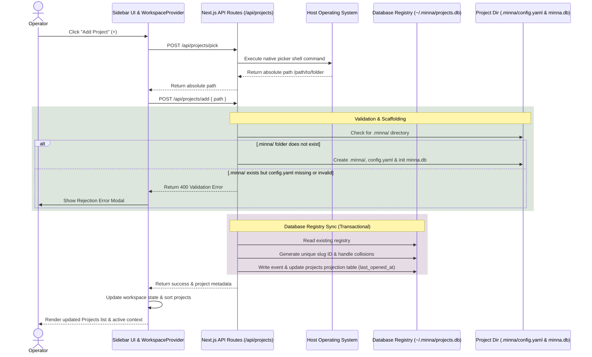

# Implementation Plan: Project Creation

This plan outlines the architecture, data flow, affected components, and validation approach for implementing the Project Creation and discovery workflow.

## Architecture

The system operates across three tiers:
1. **Frontend**: The React client ([Sidebar.tsx](file:///D:/Alvin/_CodeProjects/Project_Minna/src/components/Sidebar.tsx) and [WorkspaceProvider.tsx](file:///D:/Alvin/_CodeProjects/Project_Minna/src/components/WorkspaceProvider.tsx)) which triggers directory picking, invokes the project addition API, handles success/rejection UI states, and displays recent projects.
2. **Next.js Backend Server API**: Node.js endpoints that handle OS folder picker commands, project config read/write operations, validation logic, and registry mutations.
3. **CLI Utilities**: A narrow CLI module that syncs the registry (`~/.minna/projects.db`) whenever a CLI command runs inside a project.

---

## Data Flow

### 1. Project Picker Flow
- User clicks "+" next to "Projects" label in [Sidebar.tsx](file:///D:/Alvin/_CodeProjects/Project_Minna/src/components/Sidebar.tsx).
- Frontend sends a `POST` request to `/api/projects/pick`.
- Server handles request by spawning platform-specific child processes (Mac: `osascript`, Windows: `powershell`, Linux: `zenity`).
- Responds with `{ path: "/absolute/path/to/folder" }`.

### 2. Project Creation & Registry Sync Flow
- Frontend sends a `POST` request to `/api/projects/add` with `{ path: "/absolute/path/to/folder" }`.
- Server executes backend service:
  - **Check configuration**: Verifies existence of directory `<path>/.minna/`.
  - **Scaffold**: If the `.minna/` folder is missing, initializes `.minna/config.yaml` with version 1, current ISO timestamp, and `description: null`, and immediately scaffolds `.minna/minna.db` using the default schema configuration in [db.ts](file:///D:/Alvin/_CodeProjects/Project_Minna/src/core/db.ts) (including `events`, `features`, and `work_items` tables).
  - **Validate**: If `.minna/` already exists, checks if `.minna/config.yaml` is present and valid. If missing or invalid, returns `400 Bad Request` with error details immediately (no auto-repair or scaffolding).
  - **Lazy Database Initialization**: If `.minna/config.yaml` is present and valid but `.minna/minna.db` is missing, the backend lazily initializes the database schema inside `.minna/minna.db` during project open/import.
  - **Casing**: Project `name` is the exact name of the selected folder on disk, preserving its casing (e.g. `Project_Celia`). Project `id` is the slugified, lowercased version of the name.
  - **Register**: Reads and writes to `~/.minna/projects.db` using database transactions:
    - Generates project ID from slugified folder name.
    - If ID already exists for a different path, resolves collision by appending `-2`, `-3` etc.
    - Runs a `BEGIN IMMEDIATE TRANSACTION` to prevent concurrent write races.
    - Records `project.registered` and `project.opened` events in `events` table.
    - Updates or inserts the entry into `projects` projection table, setting `last_opened_at`.
    - Automatically exports a read-only projection copy `~/.minna/projects.json` for manual user inspections.
    - Commits transaction.
  - Responds with `{ success: true, project: { id, name, path, last_opened_at } }`.
- Frontend updates the list of projects in context, opens the project, and moves it to the top.

### 3. Sidebar Project Listing & Unavailable Projects
- The client fetches all registered projects from `/api/projects` on init/refresh.
- Sidebar renders projects directly from the registry projects list, not from features (allowing projects with zero features to render empty feature sublists).
- The server checks whether each registered project's `path` resolves on disk. Projects whose directories no longer exist are returned with an `available: false` attribute.
- The sidebar displays unavailable projects in a disabled, muted format, preventing click-to-open events.

### 4. CLI Sync & Context Resolution Flow
- Developer runs a CLI command (e.g. `status`) from within `/path/to/my-project`.
- [cli.ts](file:///D:/Alvin/_CodeProjects/Project_Minna/src/cli.ts) resolves the project context using [project-context.ts](file:///D:/Alvin/_CodeProjects/Project_Minna/src/core/project-context.ts).
  - **Traversal Walk**: Embedded resolution is enhanced to traverse upwards from the current directory through its parent chains until a `.minna/config.yaml` folder is located (instead of only checking the cwd).
  - **Shipped Alignment**: To preserve shipped behavior, an explicit `--project <key>` flag is used verbatim as a scoping label, bypassing registry blockages. If the path can be mapped, it updates the database registry `~/.minna/projects.db` with `last_opened_at`, but it never blocks CLI execution or throws database `Unknown project` errors.
- CLI executes shared backend utility to run a write transaction in `~/.minna/projects.db`, registering or updating the entry and setting the current time as `last_opened_at`.
- Clean up dead code RESOLUTION targeting `projects.yaml` in [project-context.ts](file:///D:/Alvin/_CodeProjects/Project_Minna/src/core/project-context.ts).

---

## Configuration Migration & Backward Compatibility

When migrating from legacy `minna.project.yaml` to the new `.minna/config.yaml` convention:

### 1. Schema Preservation
To preserve backwards compatibility with features like Speckit (which depend on `speckit_dir` to resolve feature spec folders), the schema of `.minna/config.yaml` includes the following optional fields:
- `speckit_dir`: String (defaults to `".specify"`)
- `github`: String or `null` (defaults to `null`)
- `default_branch`: String (defaults to `"main"`)

During migration, these fields are read from `minna.project.yaml` and written directly into `.minna/config.yaml`.

### 2. Created At Backfill
Legacy projects resolved from `minna.project.yaml` do not contain a historical `created_at` timestamp. During migration, `created_at` is backfilled in order of preference:
1. Filesystem creation time (`birthtime` stat) of the legacy `minna.project.yaml` file.
2. Initial commit timestamp of the local git repository (if Git is initialized).
3. The current migration execution timestamp.

---

## Visual Design Reference

Mockup designs for UI elements not included in the primary zip package are located at:
- **Error Modal**: [specs/002-project-creation/design/error_modal_mockup.jpg](file:///D:/Alvin/_CodeProjects/Project_Minna/specs/002-project-creation/design/error_modal_mockup.jpg)
- **Sidebar Project States**: [specs/002-project-creation/design/sidebar_project_states_mockup.jpg](file:///D:/Alvin/_CodeProjects/Project_Minna/specs/002-project-creation/design/sidebar_project_states_mockup.jpg)

These mockups define layout spacing, color rules, and visual state assets for the implementation of User Story 3 (Error Modal) and the Project row states.

> [!NOTE]
> The sidebar mockup is an illustrative visual reference meant solely to specify the layout behavior and style of the three project row states (active/highlighted, empty/no-features, and muted/unavailable). The target implementation must preserve Minna's actual brand logo, actual navigation links, chevrons, '+' affordances, and the Agent Usage widget as defined in [Sidebar.tsx](file:///D:/Alvin/_CodeProjects/Project_Minna/src/components/Sidebar.tsx). Do not implement the placeholder navigation elements shown in the mockup.

---

## Affected Areas

### Files/Components to Inspect
- [src/components/Sidebar.tsx](file:///D:/Alvin/_CodeProjects/Project_Minna/src/components/Sidebar.tsx): Location of the "Add Project" button and project navigation.
- [src/components/WorkspaceProvider.tsx](file:///D:/Alvin/_CodeProjects/Project_Minna/src/components/WorkspaceProvider.tsx): Current mock state container for projects and features.
- [src/core/project-context.ts](file:///D:/Alvin/_CodeProjects/Project_Minna/src/core/project-context.ts): Existing project context resolution.
- [src/core/types.ts](file:///D:/Alvin/_CodeProjects/Project_Minna/src/core/types.ts): Existing configurations and workspace types.

### Files/Components to Modify
- [src/components/Sidebar.tsx](file:///D:/Alvin/_CodeProjects/Project_Minna/src/components/Sidebar.tsx): Wire the "+" button to call `addProject` from workspace context, render projects from projects array, handle unavailable muted styles, and render empty lists if features are empty.
- [src/components/WorkspaceProvider.tsx](file:///D:/Alvin/_CodeProjects/Project_Minna/src/components/WorkspaceProvider.tsx): Replace mock projects state with fetched data, implement `addProject`, `openProject` and active project context state.
- [src/core/project-context.ts](file:///D:/Alvin/_CodeProjects/Project_Minna/src/core/project-context.ts): Clean up `projects.yaml` central resolution code (`resolveCentralProject` and `CENTRAL_PROJECTS_FILE`), implement upward folder traversal walking to locate `.minna/config.yaml` or legacy `minna.project.yaml`, migrate legacy configurations to the new `.minna/config.yaml` structure, and synchronize the database registry on execution.
- [src/cli.ts](file:///D:/Alvin/_CodeProjects/Project_Minna/src/cli.ts): Import and execute registry sync on initialization.

### New Files to Create
- `src/core/registry.ts`: Transactional SQLite utilities to read, write, validate, and add entries to `~/.minna/projects.db` using `BEGIN IMMEDIATE TRANSACTION`.
- `src/app/api/projects/route.ts`: API handler for listing projects.
- `src/app/api/projects/pick/route.ts`: API handler to trigger OS folder dialog.
- `src/app/api/projects/add/route.ts`: API handler to validate, scaffold, and register projects.
- `src/app/api/projects/open/route.ts`: API handler to switch projects and update `last_opened_at`.
- `src/components/ErrorModal.tsx`: High-priority modal component to display project validation errors.

### Tests to Add or Update
- `src/core/registry.test.ts`: Test registry database setup, event append, projection sync, ID collision suffixing, casing rules, concurrent database transactions, and sorting.
- `src/app/api/projects.test.ts`: Integration tests for picker, scaffolding, validation, and project open/switch endpoints.
- `src/components/__tests__/ErrorModal.test.tsx`: Test that validation failures render the modal and lock the UI.
- `src/core/project-context.test.ts`: Update tests to cover the new `.minna/config.yaml` structure, parent-chain walk search resolution, config migrations, and remove dead central resolution tests.

### Areas Out of Scope
- Project renaming and project-scoped settings dashboard.
- Automatic recovery or auto-repair of corrupt `.minna/config.yaml` files.
- Remote/cloud syncing of registry or projects.

---

## Risks and Tradeoffs

- **OS-specific command execution**: Spawning child processes on different OS platforms can fail due to headless environments, missing packages (e.g. `zenity` on Linux), or execution policy limitations on Windows.
  - *Mitigation*: Ensure robust error handling. If the OS picker fails or throws, fail gracefully and log a detailed error.
- **Concurrent database writes**: The CLI and Next.js server might access `~/.minna/projects.db` at the same time.
  - *Mitigation*: SQLite natively handles file locking and serialization. By utilizing `BEGIN IMMEDIATE` or `BEGIN EXCLUSIVE` write transactions and enabling WAL journal mode, we ensure no concurrent write races or lost updates occur.

---

## Validation Approach

1. **Unit Tests**:
   - Verify registry event writing and projection syncing.
   - Verify ID collision suffixes (`-2`, `-3` etc.) and casing rules (preserving casing for names).
   - Verify concurrent read-modify-write transactions block/queue correctly using child process workers or database locking simulations.
   - Verify project scaffolding outputs correct YAML format and creates `.minna/minna.db` event databases.
   - Verify project validation parses valid yaml, detects incorrect file permissions, and rejects malformed yaml/missing keys.
2. **API Mock/Integration Tests**:
   - Mock OS execution command outputs and verify `/api/projects/pick` handles success and error paths.
   - Verify `/api/projects/add` scaffolds `.minna/config.yaml` and `.minna/minna.db` only when `.minna/` is missing, and rejects when `.minna/` is present but config is missing.
   - Verify `/api/projects/open` updates `last_opened_at` or returns 404/410 errors on missing paths.
3. **Manual Validation**:
   - Build and run the app, select a new directory, check for `.minna/config.yaml` and `.minna/minna.db` database initialization.
   - Select a corrupt folder, verify the error modal is shown and no file changes occur.

---

## Constitution Compliance Note

- **Reconciliation with Principle III & VI**: In compliance with the Constitution, raw flat files are rejected as the source of truth for runtime project states. Project registry tracking runs through a local SQLite database event-journal (`~/.minna/projects.db`) with same-transaction projections. Flat files (`~/.minna/projects.json`) exist only as read-only exports, never parsed by the system.
- **Static Configuration**: The local project configuration `.minna/config.yaml` is used strictly as a static, version-controlled declaration container, rather than dynamic runtime state.
- **Centralized Validation**: Registry schemas and validation rules are centralized in `src/core/registry.ts` and shared between Next.js APIs and the CLI.
- **Dependencies**: No new runtime dependencies are introduced. Dialog picking relies on standard Node `child_process` and built-in system shells (PowerShell, AppleScript, standard Linux shells). ESLint and `eslint-config-next` are development-only dependencies, added after an explicit review finding so the required lint validation can run.
